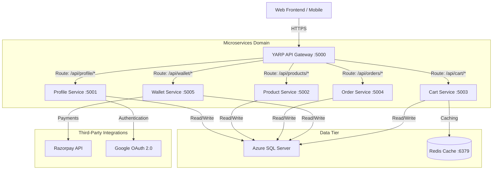

# 🛍️ ShoppingKaro (formerly EShoppingZone) - Microservices Backend

Welcome to the backend architecture of **ShoppingKaro** (formerly known as **EShoppingZone**), a premium, production-ready, Indian-market e-commerce platform designed with high performance, scalability, and robust security in mind.

This repository hosts the backend microservices built on **.NET Core (ASP.NET Core)** with an API Gateway powered by **YARP (Yet Another Reverse Proxy)**.

---

## 🏗️ Architecture Overview

The system is designed as a set of autonomous, containerized microservices that communicate securely and efficiently.



---

## 🛠️ Tech Stack & Prerequisites

Before running the application, make sure you have the following installed on your machine:

- **SDK**: [.NET 8.0 SDK / .NET 10.0 SDK](https://dotnet.microsoft.com/download)
- **Containerization**: [Docker Desktop](https://www.docker.com/products/docker-desktop/) (includes Docker Compose)
- **Database**: SQL Server (or Azure SQL database instance)
- **Caching**: [Redis](https://redis.io/)
- **IDE**: Visual Studio 2022, JetBrains Rider, or VS Code with C# Dev Kit

---

## 🚀 Getting Started & Setup Steps

### 1. Clone the Repository
```bash
git clone https://github.com/gauravkumar7819/EShoppingZone.git
cd EShoppingZone
```

### 2. Configure Environment Variables
You need to set up the environment variables for local development. Create a `.env` file inside the `backend` directory:

```bash
touch backend/.env
```

Add the following environment configuration to `backend/.env` (adjust values to your secrets):

```env
# ----------------------------------------------------
# DATABASE CONFIGURATION
# ----------------------------------------------------
AZURE_SQL_CONNECTION_STRING="Server=tcp:your-server.database.windows.net,1433;Initial Catalog=your-db;Persist Security Info=False;User ID=your-username;Password=your-password;MultipleActiveResultSets=False;Encrypt=True;TrustServerCertificate=False;Connection Timeout=30;"

# ----------------------------------------------------
# JWT AUTHENTICATION
# ----------------------------------------------------
JWT__Secret="eshoppingzone-super-secret-jwt-key-256-bits-long-change-in-production"
JWT__Issuer="EShoppingZone"
JWT__Audience="EShoppingZoneUsers"

# ----------------------------------------------------
# GOOGLE OAUTH
# ----------------------------------------------------
Google__ClientId="your-google-client-id.apps.googleusercontent.com"
Google__ClientSecret="your-google-client-secret"
Google__RedirectUri="http://localhost:5173/google-callback"

# ----------------------------------------------------
# RAZORPAY PAYMENT GATEWAY
# ----------------------------------------------------
Razorpay__KeyId="rzp_test_yourkeyid"
Razorpay__KeySecret="your-razorpay-key-secret"
Razorpay__WebhookSecret="your-razorpay-webhook-secret"
```

> [!IMPORTANT]
> Never commit the `.env` file to your source control. It has already been added to the `.gitignore`.

---

### 3. Run the Microservices

You can spin up the entire backend cluster, including Redis and all ASP.NET Core services, in one command using Docker Compose.

#### Option A: Running with Docker Compose (Recommended)
From the `backend` directory, run:
```bash
docker compose up -d --build
```
This will build and start:
- **API Gateway** on port `5000`
- **Profile Service** on port `5001`
- **Product Service** on port `5002`
- **Cart Service** on port `5003`
- **Order Service** on port `5004`
- **Wallet Service** on port `5005`
- **Redis Cache** on port `6379`

#### Option B: Running Services Locally (Bare-metal)
If you prefer running services directly via CLI, run Redis locally or in Docker first, then execute `dotnet run` inside each service folder:

```bash
# Example: Run Profile Service
cd backend/Services/Profile.Service/EShoppingZone.Profile.API
dotnet run
```

---

## 🔑 Environment Variables Reference

Below is a list of the core environment variables that control the behavior of the microservices:

| Variable Name | Description | Default / Example Value | Used By Services |
| :--- | :--- | :--- | :--- |
| `ASPNETCORE_ENVIRONMENT` | Service execution environment (`Development`/`Production`) | `Development` | All Services |
| `AZURE_SQL_CONNECTION_STRING` | Primary Azure SQL connection string | `Server=tcp:your-server...` | Profile, Product, Cart, Order, Wallet |
| `Redis__ConnectionString` | Connection address for Redis cache | `redis:6379` (Docker) or `localhost:6379` | Cart Service |
| `JWT__Secret` | Key used to sign and validate JWT tokens | `eshoppingzone-super-secret...` | All Services (Auth validation) |
| `Google__ClientId` | Google Client ID for third-party social login | `your-google-client-id...` | Profile Service |
| `Razorpay__KeyId` | Razorpay payment API Key | `rzp_test_xxxxxx` | Wallet Service |
| `Razorpay__KeySecret` | Razorpay payment API Secret | `your-secret-key` | Wallet Service |

---

## 🧪 Running Tests

The solution contains a comprehensive suite of unit and integration tests powered by **xUnit**, **Moq**, and **WebApplicationFactory**.

### Run All Tests
To run all tests across the entire solution, execute the following command from the root of the project:
```bash
dotnet test backend/EShoppingZone.Backend.sln
```

### Run Tests for a Specific Microservice
To execute tests only for a particular domain service, navigate to its test folder or specify the path:

```bash
# Run Cart Service Tests
dotnet test backend/Tests/EShoppingZone.Cart.Tests/EShoppingZone.Cart.Tests.csproj

# Run Order Service Tests
dotnet test backend/Tests/EShoppingZone.Order.Tests/EShoppingZone.Order.Tests.csproj

# Run Product Service Tests
dotnet test backend/Tests/EShoppingZone.Product.Tests/EShoppingZone.Product.Tests.csproj

# Run Profile Service Tests
dotnet test backend/Tests/EShoppingZone.Profile.Tests/EShoppingZone.Profile.Tests.csproj

# Run Gateway Routing Tests
dotnet test backend/Tests/EShoppingZone.Gateway.Tests/EShoppingZone.Gateway.Tests.csproj
```

---

## 🛡️ Code Quality & Security (SonarQube)

We use SonarQube to analyze code quality, security hotspots, and code coverage.

### Running a SonarQube Scan Locally
1. Start a SonarQube container (if not already running):
   ```bash
   docker run -d --name sonarqube -p 9000:9000 sonarqube:community
   ```
2. Install the dotnet SonarScanner tool globally:
   ```bash
   dotnet tool install --global dotnet-sonarscanner
   ```
3. Run the scanner commands:
   ```bash
   # Begin Scanner Session
   dotnet sonarscanner begin /k:"ShoppingKaro_Backend" /d:sonar.host.url="http://localhost:9000" /d:sonar.token="your-sonarqube-token"
   
   # Build the solution
   dotnet build backend/EShoppingZone.Backend.sln
   
   # End Scanner Session & upload results
   dotnet sonarscanner end /d:sonar.token="your-sonarqube-token"
   ```

---

## 📖 API Documentation (Swagger)
When running in `Development` mode, each service exposes a Swagger UI for interactive API exploration.

- **Gateway Endpoint**: `http://localhost:5000` (All API requests should route here)
- **Profile Service Swagger**: `http://localhost:5001/swagger`
- **Product Service Swagger**: `http://localhost:5002/swagger`
- **Cart Service Swagger**: `http://localhost:5003/swagger`
- **Order Service Swagger**: `http://localhost:5004/swagger`
- **Wallet Service Swagger**: `http://localhost:5005/swagger`

---

## 📄 License
This project is licensed under the MIT License - see the LICENSE file for details.