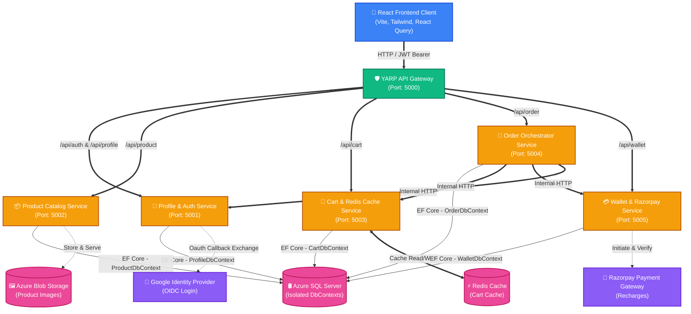
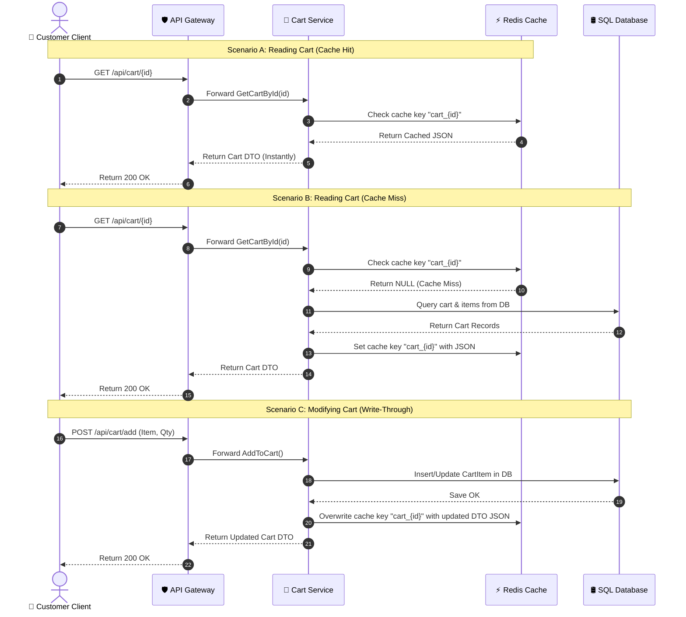
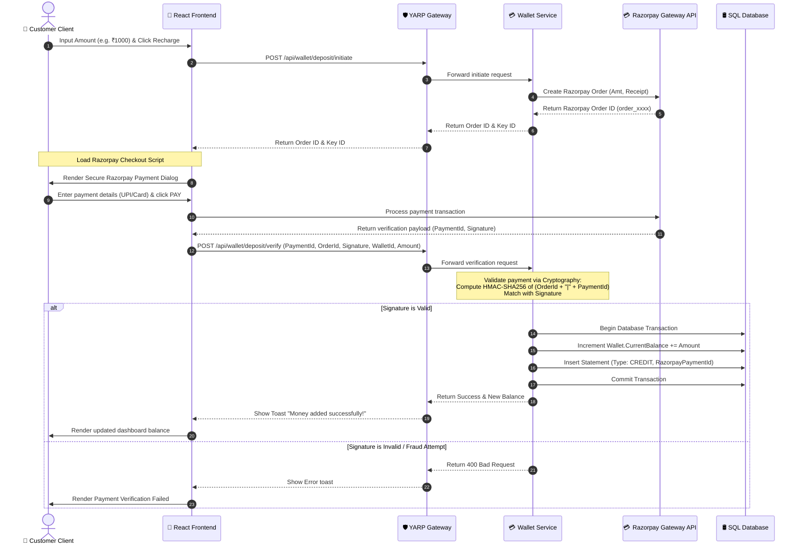
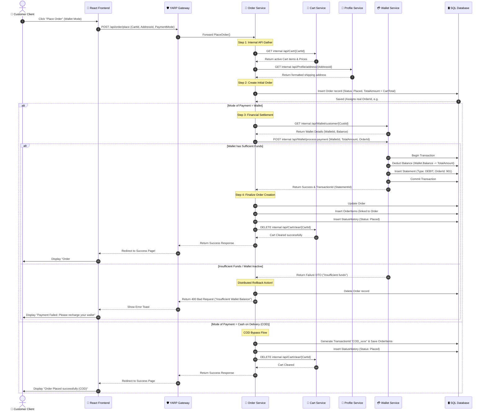

# 🛍️ ShoppingKaro (formerly EShoppingZone) Architecture & Workflow Deep-Dive

Welcome to the definitive architectural and engineering guide for **ShoppingKaro**, a premium, state-of-the-art e-commerce platform tailored for the Indian retail market. ShoppingKaro is engineered on a resilient, high-performance, and scalable distributed microservices architecture on the backend, complemented by a highly reactive, responsive, and visually stunning React SPA on the frontend.

This document provides a highly detailed architectural dissection, technical breakdowns, database models, and interactive flow diagrams mapping out critical business workflows across the application ecosystem.

---

## 🏗️ 1. High-Level Architecture Overview

ShoppingKaro utilizes a **Database-per-Service microservices pattern** coupled with a reverse proxy gateway using **Microsoft YARP (Yet Another Reverse Proxy)**. This design provides maximum loose coupling, fault isolation, and independent scalability for individual domains.

### Key Architectural Characteristics:
1. **API Gateway Routing**: The YARP API Gateway (`eshoppingzone-api-gateway`) acts as a single secure entry point. It handles path-based transformations and routes traffic down to the corresponding microservices inside an isolated Docker bridge network.
2. **State Isolation (Database-per-Service)**: Each backend microservice runs its own instance of Entity Framework Core (`DbContext`) and owns its database tables. Cross-service database queries are forbidden, preventing schema coupling.
3. **Internal Orchestration**: The `Order.Service` acts as an orchestrator, hitting other microservice endpoints internally over HTTP (`Cart.Service`, `Wallet.Service`, `Profile.Service`) to place and process orders.
4. **Caching Strategy**: The `Cart.Service` employs a high-performance Write-Through / Cache-Aside caching architecture utilizing a `Redis` instance for sub-millisecond cart retrieval times.

---

## 🛠️ 2. Comprehensive Tech Stack

### Frontend Application
- **Core Engine**: React 18 SPA built with [Vite](file:///d:/EShoppingZone_Frontend/EShoppingZone_frontend/frontend/vite.config.js) (Hot Module Replacement, ultra-fast builds).
- **Styling System**: [Tailwind CSS](file:///d:/EShoppingZone_Frontend/EShoppingZone_frontend/frontend/tailwind.config.js) for an Indian-branded premium, responsive user interface.
- **State Management & Server Cache**: `@tanstack/react-query` (React Query) for smart caching, background fetching, automatic retries, and optimistic UI mutations.
- **Client Routing**: `react-router-dom` with customized [ProtectedRoute](file:///d:/EShoppingZone_Frontend/EShoppingZone_frontend/frontend/src/App.jsx#L8) supporting role-based authorization (Customer, Merchant, Admin).
- **Network Requests**: `axios` with interceptors injecting Authorization Bearer Tokens and providing global response error handling (e.g., auto-logout on 401 Session Expired).
- **Notifications**: `react-hot-toast` for fluid, beautifully styled micro-animations.

### Backend Infrastructure
- **Framework**: ASP.NET Core 8.0 Web API, compiling down to cross-platform high-performance binaries.
- **API Gateway**: Microsoft YARP (Yet Another Reverse Proxy) for dynamic configuration, route transforms, and resilient load balancing.
- **Object Relational Mapper (ORM)**: EF Core (Entity Framework) with code-first migrations.
- **Databases**:
  - **Azure SQL Database**: Hosts application tables for persistence.
  - **Redis Cache**: Used for lightning-fast cart operations.
- **Security & Authorization**: JWT (JSON Web Tokens) with asymmetrical/symmetrical verification, token extraction, role validation, and OAuth 2.0 (Google OIDC).
- **Third-Party Integrations**:
  - **Razorpay**: API client integration for secure credit/debit card, UPI, and net banking deposits to the customer's digital wallet.
  - **Azure Blob Storage**: Storage containers for high-performance, cached product images.
- **Development Lifecycle**: Multi-stage `Dockerfiles` for each service, orchestration via `docker-compose.yml`, SonarQube integration, and Cypress E2E testing.

---

## 📦 3. Microservices Inventory

Let's drill down into the responsibilities, code architectures, and API endpoints of each core microservice on the backend.

### 👤 A. Profile & Auth Service (`Profile.Service`)
Manages identities, role definitions, standard profiles, addresses, and third-party authentication.

- **Technology**: ASP.NET Core API + EF Core + SQL Server.
- **Controllers**:
  - [AuthController.cs](file:///d:/EShoppingZone/EShoppingZone/backend/Services/Profile.Service/EShoppingZone.Profile.API/Controllers/AuthController.cs): Manages registrations (`/register/customer`, `/register/merchant`), credentials verification `/login`, and Google OAuth `/google-callback` exchanges.
  - `ProfileController.cs`: Customer/Merchant profile updates and addresses CRUD.
  - `AdminController.cs`: Enforces high-level administrative functions such as searching profiles and viewing dashboard metadata.
- **Google OAuth Integration**:
  1. Frontend redirects the user to Google OAuth endpoint.
  2. User consents, Google redirects back to `/google-callback?code=XXX`.
  3. Frontend sends authorization code to the backend.
  4. Backend exchanges authorization code with Google APIs for an access token, fetches the user info (`email`, `name`, `id`), checks if the profile exists in the DB, registers a new Customer profile if not, and responds to the frontend with a secure JWT.

---

### 📦 B. Product Service (`Product.Service`)
Maintains the inventory, catalogs, search queries, and merchant-owned product lines.

- **Technology**: ASP.NET Core API + EF Core + SQL Server + Azure Blob Storage.
- **Controllers**:
  - `ProductController.cs`: Public-facing catalog searches, filters, categories, and specific product information retrieval.
  - `MerchantProductController.cs`: Role-authorized endpoints for merchants to create, edit, delete, and restock products.
  - `AdminProductController.cs`: Admin auditing endpoints to manage products and override inventories.
- **Product Media Flow**:
  - Merchants upload images directly through the product dashboard.
  - `Product.Service` uploads the image binary asynchronously to Azure Blob Storage and stores the generated public URL in the SQL database.

---

### 🛒 C. Cart Service (`Cart.Service`)
Provides temporary caching and shopping cart management, ensuring high responsiveness under high user traffic.

- **Technology**: ASP.NET Core API + EF Core + Redis Cache (`IDistributedCache`).
- **Controllers**:
  - `CartController.cs`: Core CRUD for cart items, clearing carts, and calculating breakdowns.
- **Write-Through Caching Logic**:
  - **Reads**: To avoid choking the relational database, `Cart.Service` first checks Redis. On a cache hit, the JSON string is immediately deserialized and returned. On a cache miss, it reads from SQL Server, caches it, and returns the DTO.
  - **Writes**: Operations like "Add to Cart" or "Change Quantity" commit the updates directly to the SQL database to ensure hard consistency and immediately overwrite the cached value in Redis with the latest state.
  - **Clears/Deletes**: Completely invalidates the Redis cache key (`cart_{id}`) to prevent stale reads.

---

### 💳 D. Wallet Service (`Wallet.Service`)
Operates as the financial heart of the platform, managing digital cash transactions, statements, and payment gateway interactions.

- **Technology**: ASP.NET Core API + EF Core + Razorpay .NET SDK.
- **Controllers**:
  - `WalletController.cs`: Wallet balances, credit deposits, statements history, and internal merchant payouts/order payments.
- **Razorpay Payment Verification Workflow**:
  - Standard cryptography is used to prevent transaction tampering.
  - During deposits, a signature is generated via Razorpay's API and validated on the backend using HMAC-SHA256 signature verification matching with the local secret.

---

### 📝 E. Order Service (`Order.Service`)
Orchestrates order creation, coordinates multi-service payment checking, manages tracking status histories, and aggregates global analytics.

- **Technology**: ASP.NET Core API + EF Core + Dynamic HTTP Service Clients.
- **Controllers**:
  - [OrderController.cs](file:///d:/EShoppingZone/EShoppingZone/backend/Services/Order.Service/EShoppingZone.Order.API/Controllers/OrderController.cs): Places orders (`/place`), customer histories (`/customer/{id}`), cancellations (`/{id}/cancel`), tracking timelines, and admin overrides.
  - `AdminAnalyticsController.cs`: Computes total earnings, order frequencies, top-selling categories, and metrics.
- **Dynamic Integrations**:
  - Coordinates inter-service HTTP calls using [CartServiceClient](file:///d:/EShoppingZone/EShoppingZone/backend/Services/Order.Service/EShoppingZone.Order.API/Integrations/CartServiceClient.cs), [WalletServiceClient](file:///d:/EShoppingZone/EShoppingZone/backend/Services/Order.Service/EShoppingZone.Order.API/Integrations/WalletServiceClient.cs), and `ProfileServiceClient`.

---

## 🔄 4. Detailed Architectural Workflows & Diagrams

### 🛒 Workflow 1: Cart Caching Strategy (Write-Through Cache-Aside)

This diagram details the exact read-write workflow implemented in [CartService.cs](file:///d:/EShoppingZone/EShoppingZone/backend/Services/Cart.Service/EShoppingZone.Cart.API/Services/CartService.cs) to achieve maximum performance and low database load:

---

### 💳 Workflow 2: Wallet Recharge & Verification (Razorpay)

Recharging the wallet is protected against fraudulent injection using strict signature checks.

---

### 📝 Workflow 3: E2E Order Placement Orchestration & Transaction Rollback

This is the most critical distributed transaction workflow. The order placement is managed inside a robust, resilient flow with rollback capabilities in case of insufficient funds or service crashes.

---

## 🔒 5. Key Design Patterns Implemented

1. **API Gateway Transform Pattern**: Inside [appsettings.json](file:///d:/EShoppingZone/EShoppingZone/backend/EShoppingZone.ApiGateway/appsettings.json), YARP utilizes Path Transformations to strip prefixes and cleanly match routing structures without altering the underlying service routing controllers.
2. **Write-Through / Cache-Aside Caching**: Cart Service ensures high-performance shopping cart updates by checking Redis first (Cache-Aside) and writing to both databases on changes (Write-Through).
3. **Database-per-Service**: Promotes structural integrity. Services communicate through synchronous HTTP endpoints, guaranteeing schema isolation.
4. **Saga-like Rollback Pattern**: Handled synchronously in `OrderService`. When an order is initially created in the database, the corresponding payment deduction is triggered. If the payment service returns a failure, the Order Service executes a clean database delete of the pending order to restore consistency.
5. **Secure Cryptographic Verifications**: Recharges use HMAC-SHA256 signatures validated against Razorpay keys to prevent client-side payment forgery.

---

## 🐳 6. Containerization and Deployment Topology

### Local Multi-Container Development Setup
The platform is fully orchestrated locally using Docker. The [docker-compose.yml](file:///d:/EShoppingZone/EShoppingZone/backend/docker-compose.yml) orchestrates 7 independent containers:
1. `eshoppingzone-profile-service`: Profile & Auth Service API.
2. `eshoppingzone-product-service`: Product Catalog Service API.
3. `eshoppingzone-redis`: Redis Alpine container for Cart Caching.
4. `eshoppingzone-cart-service`: Cart caching API.
5. `eshoppingzone-order-service`: Order orchestrator API.
6. `eshoppingzone-wallet-service`: Wallet transaction API.
7. `eshoppingzone-api-gateway`: YARP reverse proxy gateway.

All containers are linked using a customized bridge network (`eshoppingzone-network`), allowing secure service discovery via internal service names.

### Production Cloud Topology (Azure Container Apps)
When running in production, environment variables are loaded to point directly to cloud resources:
- **Compute**: Deployed on **Azure Container Apps** (serverless microservices that scale to zero based on HTTP traffic or CPU usage).
- **Relational Storage**: Connects to a high-capacity, geo-replicated **Azure SQL Database**.
- **Caching**: Scaled via **Azure Cache for Redis**.
- **Media Assets**: Served using CDN-backed **Azure Blob Storage**.
