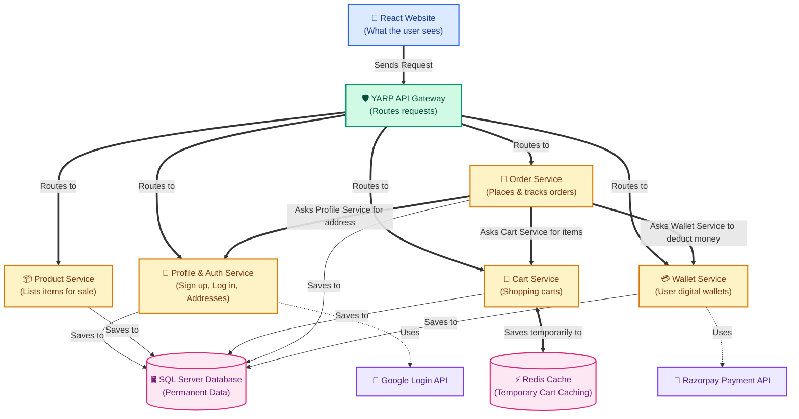
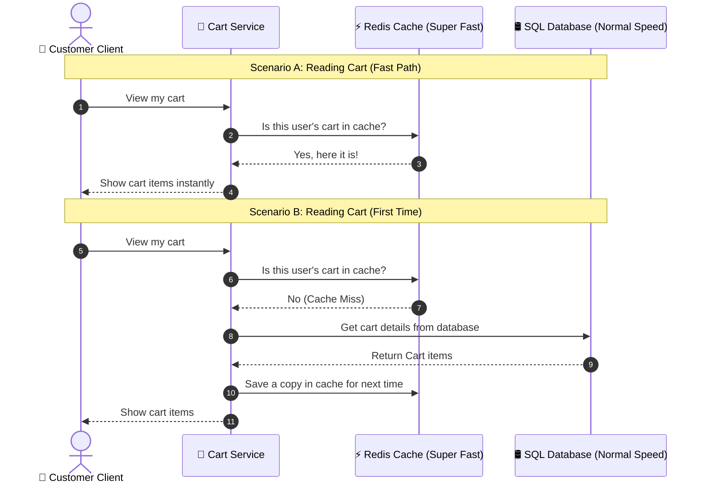
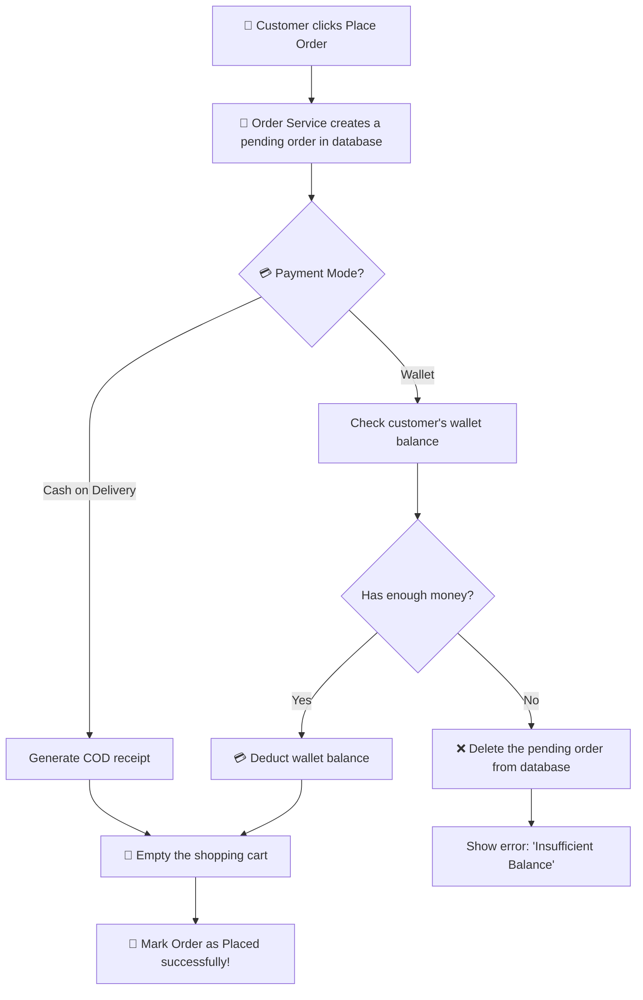

# 🛍️ ShoppingKaro - Simple Project Overview & Workflows

Welcome! This is an easy-to-understand guide to how **ShoppingKaro** (formerly *EShoppingZone*) works. We will explain how the frontend and backend talk to each other, how data is saved, and how the main features work using simple language and clear diagrams.

---

## 🏗️ 1. What is the Project Structure?

ShoppingKaro is divided into three main layers:

1.  **Frontend (The Visual App)**: This is the website that customers and merchants see in their browsers. It is built using **React** and **Tailwind CSS** (for styling). It is fast and works well on mobile phones and computers.
2.  **API Gateway (The Traffic Router)**: A single entry point called **YARP** (Yet Another Reverse Proxy). Think of it as a security guard or receptionist. When the frontend asks for something, the gateway looks at the request and sends it to the correct backend service.
3.  **Backend Services (The Engines)**: Instead of one giant backend program, ShoppingKaro uses **5 small, independent backend services** (called microservices). Each service has its own specific job and its own private tables in a **SQL Server Database**.

Here is a simple picture of how they connect:

---

## ⚙️ 2. The 5 Backend Services Explained Simply

### 👤 A. Profile & Auth Service (`Profile.Service`)
*   **What it does**: Handles user accounts.
*   **Simple Terms**: When you sign up, log in, add your delivery address, or log in with your Google account, this service handles it. It verifies your password and gives you a secure "pass" (called a JWT Token) so the system knows who you are.

### 📦 B. Product Service (`Product.Service`)
*   **What it does**: Manages the store catalog.
*   **Simple Terms**: It stores information about all the products (name, description, price, how many are in stock). Merchants use this to add new products, and customers use this to search and view items. Product images are simply stored as web links (URLs) in the database.

### 🛒 C. Cart Service (`Cart.Service`)
*   **What it does**: Manages what you want to buy.
*   **Simple Terms**: When you click "Add to Cart", this service saves it. To make the website super fast, it saves your cart items in a temporary, high-speed memory box called **Redis**. It also saves a backup copy in the SQL database.

### 💳 Wallet Service (`Wallet.Service`)
*   **What it does**: Handles your digital cash.
*   **Simple Terms**: Every customer gets a digital wallet. You can add money into it from your real bank account using **Razorpay**. You can then use this wallet balance to make instant payments for your purchases.

### 📝 Order Service (`Order.Service`)
*   **What it does**: Handles checkout and order management.
*   **Simple Terms**: When you click "Place Order", this service does the heavy lifting. It fetches the items in your cart, checks your address, tells the Wallet Service to deduct your balance, creates a final invoice, and empties your cart.

---

## 🔄 3. Main Workflows Explained Simply

### 🛒 Workflow 1: How Cart Caching Works (Fast Shopping)
To prevent the website from slowing down when thousands of users are shopping, the **Cart Service** checks a high-speed memory called **Redis** before looking in the main database.

---

### 💸 Workflow 2: Adding Money to Your Wallet (Razorpay Deposit)
When you want to load money into your digital wallet, we use **Razorpay** to process the payment safely and prevent fraud.

1.  **Request Deposit**: You type the amount on the website and click "Add Money".
2.  **Create Order**: The backend asks Razorpay to initiate a secure transaction.
3.  **Payment Modal**: A secure window pops up on your screen. You pay using UPI, card, or netbanking.
4.  **Security Check**: Razorpay sends a secret code (signature) back to our backend.
5.  **Balance Updated**: The backend verifies this signature using cryptography. If it's valid, it increases your wallet balance in the database and records a transaction statement.

---

### 📝 Workflow 3: How an Order is Placed (Orchestration & Safety Net)
When you click **"Place Order"**, the **Order Service** coordinates everything. If something goes wrong (like not having enough wallet balance), it automatically cancels the process so you don't lose money.

---

## 🔒 4. Key Takeaways

*   **Loose Coupling**: Since each service is separate, if the *Product Service* goes down, users can still view their *Profiles* or *Wallets* without the whole site crashing.
*   **Fast Caching**: By using **Redis** for shopping carts, product adding and cart changes load almost instantly.
*   **Safe Transactions**: If a payment fails during checkout, the database deletes the pending order automatically, ensuring your cart items are preserved and no money is lost.
*   **No Azure Blob Storage**: All product images are managed as direct web URLs in the database, keeping the asset hosting simple and lightweight.
